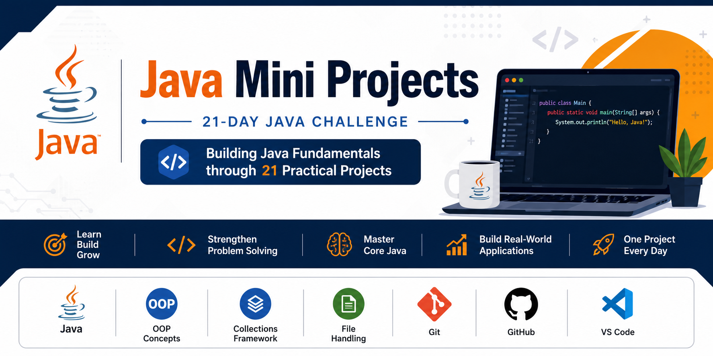

<p align="center">
  
</p>

<h1 align="center">🚀 Java Mini Projects</h1>


<p align="center">
  
  
  
  
</p>

<p align="center">
  
  
  
  
</p>

<p align="center">
  

</p>


# 🚀 Java Mini Projects

A collection of **21 Java Mini Projects** built to strengthen **Core Java**, **Object-Oriented Programming (OOP)**, **Collections Framework**, **File Handling**, and **Problem-Solving Skills**.

This repository is part of my **21-Day Java Learning Challenge**, where I build one Java project every day while preparing for **Software Development Engineer (SDE-1)** interviews.

---

## 🎯 Goals

* Master Core Java
* Build strong OOP fundamentals
* Practice Java Collections Framework
* Learn File Handling
* Improve problem-solving skills
* Follow Git & GitHub best practices
* Build a professional Java portfolio

---

## 🛠️ Technologies Used

* Java
* VS Code
* Git
* GitHub

---

## 📂 Repository Structure

```text
Java-Mini-Projects
│
├── .gitignore
├── LICENSE
├── README.md
│
├── 01-Calculator-App
├── 02-Student-Management-System
├── 03-Bank-Management-System
├── 04-Number-Guessing-Game
├── 05-Contact Management System
├── ...
└── 21-Mini-ECommerce-App
```

---

# 📅 21-Day Progress Tracker

## 📅 21-Day Progress Tracker

| Day      | Project                              | Status      |
|----------|--------------------------------------|-------------|
| ✅ Day 1  | Calculator App                       | Completed   |
| ✅ Day 2  | Student Management System            | Completed   |
| ✅ Day 3  | Bank Management System               | Completed   |
| ✅ Day 4  | Number Guessing Game                 | Completed   |
| ✅ Day 5  | Contact Management System            | Completed   |
| ✅ Day 6  | Library Management System            | Completed   |
| ✅ Day 7  | To-Do List Manager                   | Completed   |
| ✅ Day 8  | Quiz Application                     | Completed   |
| ✅ Day 9  | Expense Tracker                      | Completed   |
| ✅ Day 10 | ATM Simulation                       | Completed   |
| ✅ Day 11 | Movie Ticket Booking System          | Completed   |
| ✅ Day 12 | Inventory Management System          | Completed   |
| ✅ Day 13 | Hotel Reservation System             | Completed   |
| ✅ Day 14 | File-Based Student Management System | Completed   |
| ⏳ Day 15 | Notes Manager                        | Coming Soon |
| ⏳ Day 16 | Password Generator                   | Coming Soon |
| ⏳ Day 17 | Voting System                        | Coming Soon |
| ⏳ Day 18 | Online Shopping Cart                 | Coming Soon |
| ⏳ Day 19 | Parking Lot Management System        | Coming Soon |
| ⏳ Day 20 | Employee Payroll System              | Coming Soon |
| ⏳ Day 21 | Mini E-Commerce Console App          | Coming Soon |
---

## 📚 Java Concepts Covered

* Variables & Data Types
* Operators
* Control Statements
* Methods
* Classes & Objects
* Constructors
* Encapsulation
* Inheritance
* Polymorphism
* Abstraction
* Collections Framework
* Exception Handling
* File Handling
* Menu-Driven Applications
* Object-Oriented Design

---

## 🌟 About This Repository

This repository documents my journey of building Java applications from basic to intermediate level. Every project is developed with a focus on writing clean, readable, and maintainable code while strengthening problem-solving and software development skills.

---

### ⭐ If you find this repository helpful, feel free to star it!
